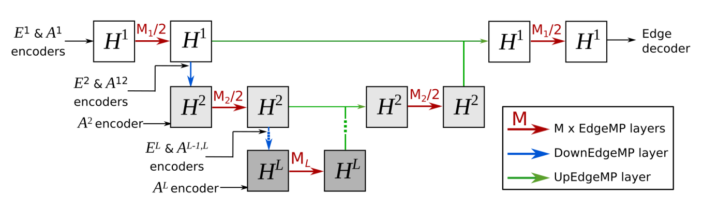
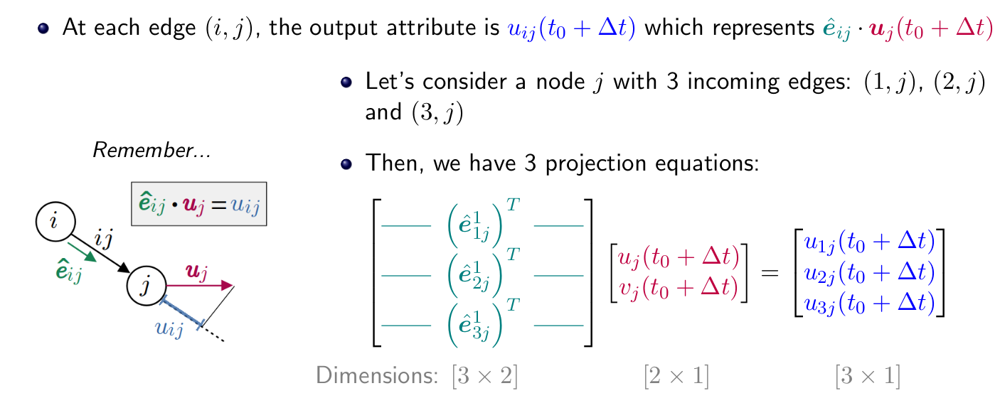

# REMuGNN know-how
- [x] GNNs
- [x] PyG
- [x] Tensor board with CORA
- [x] Single-Scale vs MultiScale
- [x] Message Passing
- [ ] Edge feature vector
- [ ] Rotation equivariance via directed angles
  -
  -
- [ ]

# Tasks
- [ ] Focus on invariance approaches
  - [ ] Use the new light datasets
  - [ ] position and velocity and reynolds Re number
  - [ ] NsMuSGNN
  - [ ] Threescale
- [ ] Benchmark the performance of REMuGNN. Is really this conformed to? :
  - $$
    GNN(R(G)) = R(GNN(G))
    $$
- [ ] Setup Tensor board with benchmark metrics to agree on with @Mario
- [ ] compare to e3nn rotation impl

# Q&A
- [x] why MLP? maybe you can use GCN. MP is better by far than GCN empirically.
- [ ] Covariance VS Invariance VS equivariance
  - [ ] classification approaches
  - [ ] in Invariance, scalar features are used
  - [ ] in equivariance, non scalars or vectors can be used
- [ ] Credits ar 79 ECTS I will finish 1 module with the thesis
- [ ] Timeline and registeration before May 1s? or after?
- What is this? why the 0.15 voxel size??
```
batch_transform = transforms.Compose([
    gfd.transforms.GridClustering([0.15, 0.30]),
])
```
how batch transform happens? check vocxeling impl. Indexing is very important
- [ ] remove `gfd.transforms.ConnectKNN(6, period=[None, "auto"]),` periodicity
- [ ] Test the rotation equivariance by applyingi a rotation matrix via PyG